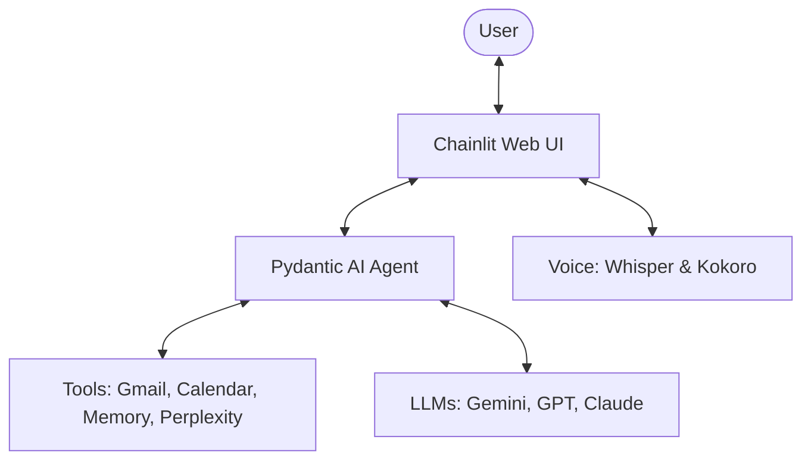

# Agent Penny

Agent Penny is a personal AI assistant built with [Chainlit](https://docs.chainlit.io/) and `pydantic-ai`. It provides a conversational interface that can leverage large language models (LLMs), external tools, and your personal data to act as a powerful and context-aware assistant. The agent supports optional Google OAuth for Calendar and Gmail, persistent memory, optional web search via Perplexity/Tavily/DuckDuckGo, and a configurable "thinking" mode for supported models.

## Architecture Overview

Agent Penny is designed as a modular AI assistant that integrates several modern technologies:

- **Frontend**: [Chainlit](https://docs.chainlit.io/) provides the web interface, handling chat, audio streaming, and OAuth flow.
- **Agent Orchestration**: [Pydantic AI](https://ai.pydantic.dev/) manages the agent's logic, model interactions, and tool execution.
- **Model Support**: Supports multiple LLM providers (Google Gemini, OpenAI, Anthropic, AWS Bedrock) through a unified interface.
- **Voice Stack**: Uses `faster-whisper` for efficient on-device speech-to-text and `kokoro` for high-quality text-to-speech.
- **Integrations**: Connects to Google Services (Gmail, Calendar) and external APIs like Perplexity for web search.
- **Observability**: Built-in tracing and logging via [Logfire](https://pydantic.dev/logfire) and [Loguru](https://loguru.readthedocs.io/).



## Features

### Core Features

- **Conversational AI**: Natural, context-aware conversations powered by `pydantic-ai`.
- **Voice Interaction**: Real-time speech-to-text using `faster-whisper`, voice activity detection with `silero-vad`, and high-quality text-to-speech using `kokoro`.
- **Extensible Toolset**: Add new tools alongside built-ins like current date, memory, and integrations.
- **User-Specific Persistent Memory**: Per-user memory stored on disk for continuity and personalization.
- **Multi-LLM Support**: Works with next-generation OpenAI (GPT-5.2), Google (Gemini 3.1 and 2.5), Anthropic (Claude 4.6), and Bedrock-backed models.
- **Conversation Starters**: Pre-defined prompts like "📅 Today's Calendar" and "✉️ Mail Summary".
- **Observability**: OpenTelemetry-based observability via `logfire` and JSON logging via `loguru`.
- **Container-Ready**: Includes a `Dockerfile` for deployment.

### Integrations

- **Google**: Securely connect your Google account to enhance your assistant with:
  - **Google Calendar**: List calendars, view events, and add new events.
  - **Gmail**: Access emails and manage drafts directly within the chat interface. Automatically converts HTML emails to markdown for better readability.
- **Perplexity**: (Optional) Integrate with Perplexity AI for web searches.
- **Tavily Search**: (Optional) Integrate with Tavily for optimized AI web searches.
- **DuckDuckGo Search**: (Optional) Enable built-in DuckDuckGo search.

### Tools

The agent comes equipped with the following tools:

- **Google Calendar**: `calendar_list`, `calendar_list_events`, and `calendar_create_event`.
- **Gmail**: `email_list_messages`, `email_list_drafts`, `email_get_draft`, `email_create_draft`, `email_update_draft`, and `email_delete_draft`.
- **Perplexity**: `perplexity` for web searches (requires API key).
- **Tavily Search**: `tavily_search` for web searches (requires API key).
- **DuckDuckGo Search**: `duckduckgo_search_tool` for web searches (enabled with `DUCKDUCKGO_SEARCH_ENABLED=true`).
- **Memory**: `load_memory` and `save_memory` for long-term persistence.
- **Utility**: `current_date` for the current date and time.

## Authentication

Agent Penny uses Google OAuth for user authentication only when you provide Google OAuth credentials. When enabled, you will be asked to grant permission for the application to access your Google Calendar and Gmail. This is a secure process that allows the agent to work with your data without storing your credentials. If Google OAuth is not configured, the app runs in standalone mode and identifies you by your system username.

The application requests the following scopes:

- `https://www.googleapis.com/auth/userinfo.profile`
- `https://www.googleapis.com/auth/userinfo.email`
- `https://www.googleapis.com/auth/gmail.readonly`
- `https://www.googleapis.com/auth/gmail.compose`
- `https://www.googleapis.com/auth/calendar.readonly`
- `https://www.googleapis.com/auth/calendar.events.owned`

To grant Agent Penny access to your email and calendar, you'll need to set up OAuth.

1. Generate JWT Token for Chainlit using `chainlit create-secret`.
  - Save the secret as `CHAINLIT_AUTH_SECRET=XXXX` in `.env` or pass it to chainlit as an environment variable.
2. Set up a client ID and client secret for access to your email and calendar.
  - For Google:
    1. Create a Google Application following [Google Identity Docs](https://developers.google.com/identity/protocols/oauth2). Use the `Web Application` client type. If this is your first Google Application, you'll have to provide some Branding details like App Information as well.
    2. Set Authorized JavaScript Origins as `http://localhost:8000`
    3. Set Authorized Redirect URIs as `http://localhost:8000/auth/oauth/google/callback`
    4. Under Audience - Add your own Gmail as a test user.
3. Start Agent Penny with the provided `OAUTH_GOOGLE_CLIENT_ID` and `OAUTH_GOOGLE_CLIENT_SECRET` as an environment variable.

For other OAuth providers, check out the [Chainlit OAuth docs](https://docs.chainlit.io/authentication/oauth).

## Getting Started

### Prerequisites

- Python 3.12
- uv (recommended) or another Python environment manager
- An LLM API key (Google, OpenAI, Anthropic, or AWS Bedrock)
- A Google OAuth Client ID and Secret (only if using Calendar/Gmail)
- FFmpeg (required for voice interaction features)

### Installation

1.  Clone the repository:
    ```bash
    git clone https://github.com/dgootman/agent-penny.git
    cd agent-penny
    ```

2. Install system dependencies:
    - Install FFmpeg (required for voice features):
      - macOS: `brew install ffmpeg`
      - Ubuntu/Debian: `sudo apt update && sudo apt install ffmpeg`
      - CentOS/RHEL: `sudo yum install ffmpeg`

3. Create a virtual environment and install the Python dependencies using `uv`:

    ```bash
    uv venv
    uv sync
    ```

## Usage

### Standalone Mode (Without Google OAuth)

Agent Penny can be run without Google OAuth for local development or if you do not require Google integrations (Calendar or Gmail). To enable standalone mode, simply omit the `OAUTH_GOOGLE_CLIENT_ID` and `OAUTH_GOOGLE_CLIENT_SECRET` environment variables. In this mode:

- User authentication will use your system's username.
- Google Calendar and Gmail tools will not be available.
- Other features, such as LLM interaction, Perplexity search (if configured), and persistent memory, will function as usual.

### With Google OAuth

1.  Set the environment variables for your chosen LLM and other configurations. For example:

    **For Google Gemini:**
    ```bash
    export MODEL='google-gla:gemini-3-flash-preview' # or google-gla:gemini-3-pro-preview
    export GOOGLE_API_KEY='your-google-api-key'
    export OAUTH_GOOGLE_CLIENT_ID='your-google-oauth-client-id'
    export OAUTH_GOOGLE_CLIENT_SECRET='your-google-oauth-client-secret'
    # Optional: Enable thinking mode
    export THINKING='true'
    ```

    **For OpenAI:**
    ```bash
    export MODEL='openai:gpt-5.2' # or openai:gpt-5-mini, openai:gpt-5-nano
    export OPENAI_API_KEY='your-openai-api-key'
    export OAUTH_GOOGLE_CLIENT_ID='your-google-oauth-client-id'
    export OAUTH_GOOGLE_CLIENT_SECRET='your-google-oauth-client-secret'
    # Optional: Enable thinking mode
    export THINKING='true'
    ```

    **For Anthropic:**
    ```bash
    export MODEL='anthropic:claude-opus-4-6' # or anthropic:claude-sonnet-4-6
    export ANTHROPIC_API_KEY='your-anthropic-api-key'
    export OAUTH_GOOGLE_CLIENT_ID='your-google-oauth-client-id'
    export OAUTH_GOOGLE_CLIENT_SECRET='your-google-oauth-client-secret'
    # Optional: Enable thinking mode
    export THINKING='true'
    ```

    For other providers and models, refer to the [Pydantic AI Models Documentation](https://ai.pydantic.dev/models/).

2.  Run the application:
    ```bash
    chainlit run -w app.py
    ```

3.  Open your web browser and navigate to `http://localhost:8000`.

## Docker

You can also build and run the application using Docker.

1.  Build the Docker image:
    ```bash
    docker build -t agent-penny .
    ```

2.  Run the Docker container, making sure to pass all necessary environment variables:
    ```bash
    docker run -p 8000:8000 \
      -e MODEL='your-chosen-model' \
      -e GOOGLE_API_KEY='your-google-api-key' \
      -e OAUTH_GOOGLE_CLIENT_ID='your-google-oauth-client-id' \
      -e OAUTH_GOOGLE_CLIENT_SECRET='your-google-oauth-client-secret' \
      -e PERPLEXITY_API_KEY='your-perplexity-api-key' \ # Optional
      agent-penny
    ```

## Development

The project includes a `Makefile` to simplify common development tasks:

- `make build`: Syncs dependencies, runs linting (ruff), and type checking (mypy).
- `make dev`: Runs the application in development mode with hot reloading.
- `make test`: Runs the test suite using `pytest`.
- `make readme`: Updates the README.md file using the `update-readme` skill.
- `make review`: Reviews staged changes using the `code-reviewer` skill.

## Configuration

### Models & Thinking

- `MODEL`: (Required) Specifies the LLM to use.
    - **Anthropic**: `anthropic:claude-opus-4-6`, `anthropic:claude-sonnet-4-6`, etc.
    - **Google**: `google-gla:gemini-3.1-pro-preview`, `google-gla:gemini-3-pro-preview`, `google-gla:gemini-2.5-flash`, etc.
    - **OpenAI**: `openai:gpt-5.2`, `openai:gpt-5-mini`, etc.
    - **Bedrock**: `bedrock:us.anthropic.claude-opus-4-6-v1`, `bedrock:us.anthropic.claude-sonnet-4-6:0`, etc.
- `THINKING`: (Optional) Set to `true` to enable LLM thinking mode. This allows the model to "reason" before providing an answer, which is displayed as a separate step in the UI.

### API Keys & Providers

- `GOOGLE_API_KEY`: Required for Google models.
- `OPENAI_API_KEY`: Required for OpenAI models.
- `ANTHROPIC_API_KEY`: Required for Anthropic models.
- `BEDROCK_ENABLE`: Set to any value to enable Bedrock models (requires AWS credentials configured in your environment).

### Integrations

- `WHISPER_MODEL`: (Optional) Enables voice interaction. Set to a Whisper model size (e.g., `base`, `small`, `medium`). If enabled, you can talk to Penny by clicking the microphone icon.
- `OAUTH_GOOGLE_CLIENT_ID` & `OAUTH_GOOGLE_CLIENT_SECRET`: (Optional) Required for Google Calendar and Gmail integration.
- `PERPLEXITY_API_KEY`: (Optional) Enables the `perplexity` tool for real-time web searches.
- `TAVILY_API_KEY`: (Optional) Enables the `tavily_search` tool for real-time web searches.
- `DUCKDUCKGO_SEARCH_ENABLED`: (Optional) Set to `true` to enable DuckDuckGo web search.

### Observability & System

- `LOGFIRE_SEND_TO_LOGFIRE`: (Optional) Set to `true` to send traces to Logfire.
- `OTEL_SERVICE_NAME`: (Optional) Set the service name for OpenTelemetry traces. Defaults to `agent-penny`.
- `OTEL_EXPORTER_OTLP_ENDPOINT`: (Optional) The endpoint for the OTLP exporter.
- `LOGURU_LEVEL`: (Optional) Sets the logging level. Defaults to `DEBUG`. Set to `TRACE` for verbose event logging.
- `DATA_DIR`: (Optional) Specifies the directory to store agent data, such as memories. Defaults to `~/.local/share/agent-penny`.

### Voice Interaction

When `WHISPER_MODEL` is set, Agent Penny supports full voice-to-voice interaction:
1. **Speech-to-Text**: Uses `faster-whisper` to transcribe your voice in real-time.
2. **Text-to-Speech**: Uses `kokoro` to read the agent's response back to you.
*Note: The first time you use voice, models will be downloaded automatically (requires several GB of space depending on the chosen Whisper model).*

**Important**: FFmpeg must be installed on your system for voice features to work. Install FFmpeg using your system's package manager:
- macOS: `brew install ffmpeg`
- Ubuntu/Debian: `sudo apt update && sudo apt install ffmpeg`
- CentOS/RHEL: `sudo yum install ffmpeg`

### Thinking Mode

Thinking mode enables advanced reasoning capabilities for supported models. When enabled:
- The agent's internal thought process is visible in the Chainlit UI under a "Thinking" step.
- This is particularly useful for complex tasks like summarization, scheduling, or coding.

## Built With

- [Chainlit](https://docs.chainlit.io/): For the web UI and chat interface.
- [pydantic-ai](https://github.com/pydantic/pydantic-ai): For the agent and LLM interaction.
- [Tavily Python](https://github.com/tavily-ai/tavily-python): For Tavily search integration.
- [MarkItDown](https://github.com/microsoft/markitdown): For converting HTML emails to text.
- [Loguru](https://loguru.readthedocs.io/): For logging.
- [Logfire](https://pydantic.dev/logfire): For observability.
- [Faster Whisper](https://github.com/SYSTRAN/faster-whisper): For speech-to-text.
- [Kokoro](https://github.com/hexgrad/kokoro): For text-to-speech.
- [Silero VAD](https://github.com/snakers4/silero-vad): For voice activity detection.
- [ua-parser](https://github.com/ua-parser/uap-python): For user agent parsing.

---

🚀 **This README brought to you by Google Gemini** ✨
